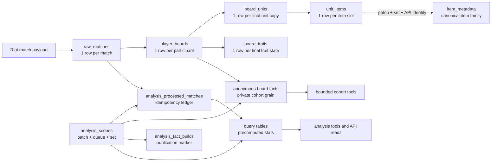
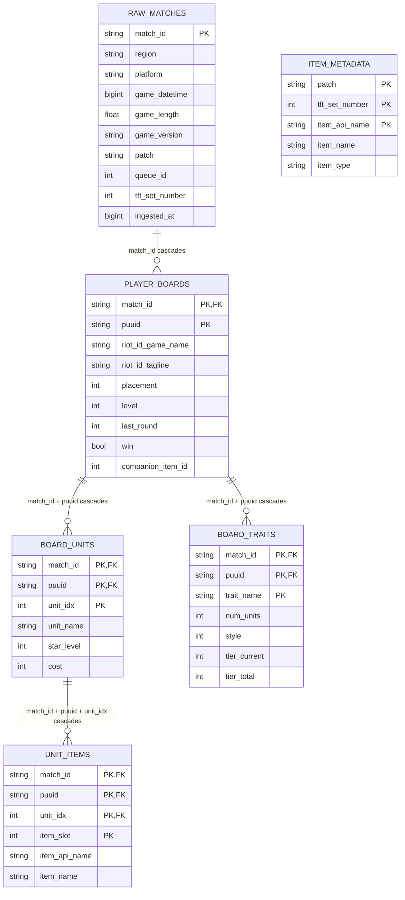
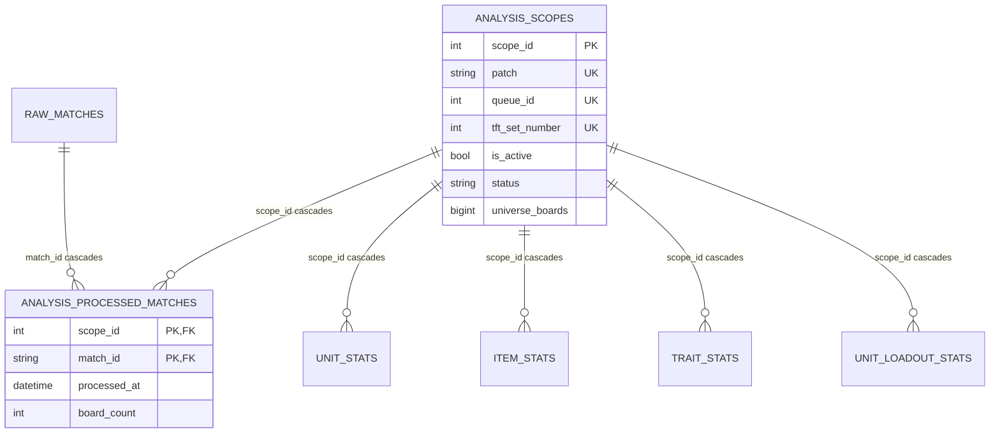
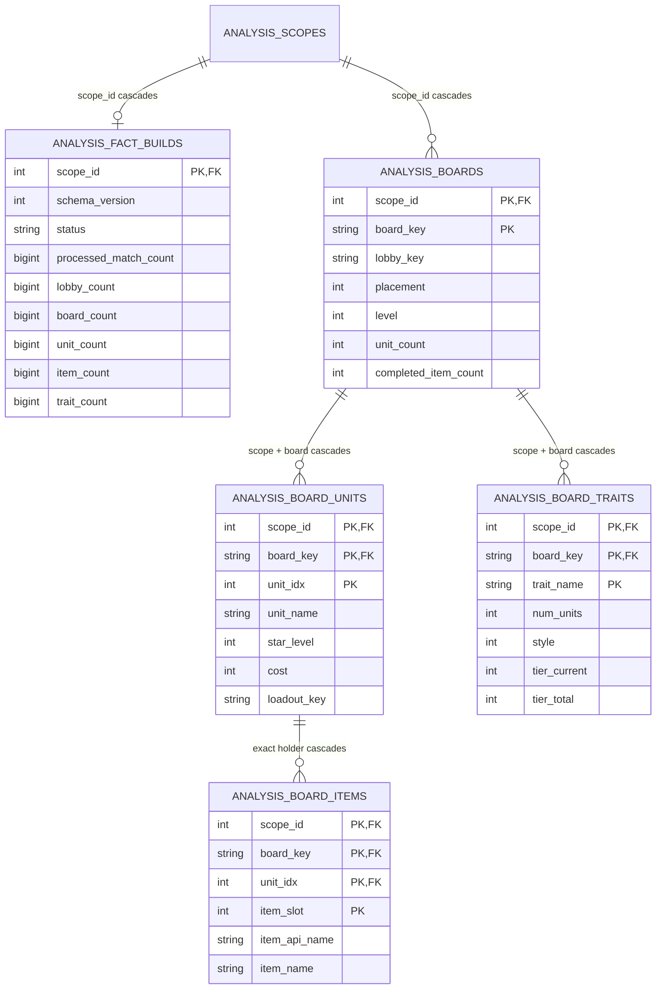
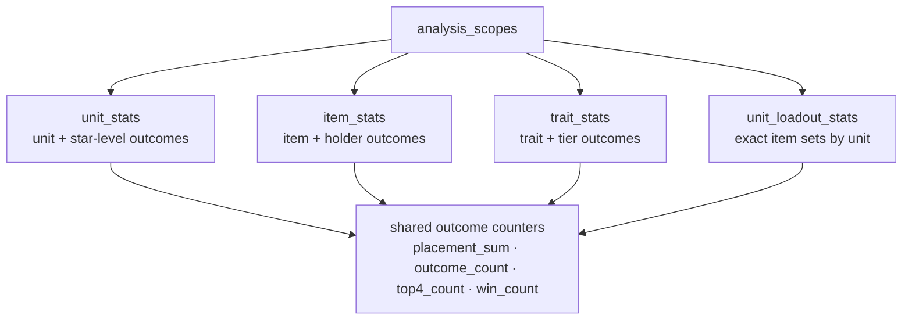
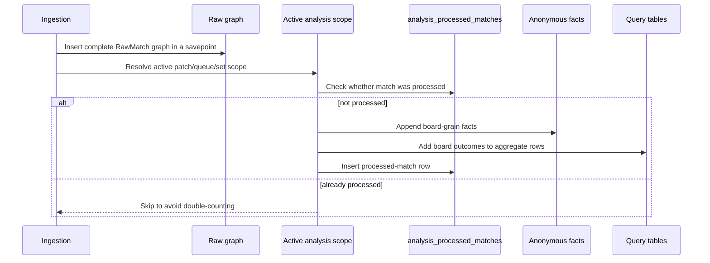

# Database models

The runtime database stores Teamfight Tactics match data as a normalized raw
graph, a private anonymous fact layer, scoped aggregate projections, and a
compatibility board projection. The raw graph preserves exact match payload
structure without repeating match metadata per participant, while the fact and
aggregate layers provide bounded analytical shapes for tools and APIs.

## Runtime model boundary

`RUNTIME_MODELS` in `db.models` is the authoritative creation set. It contains
the six ingestion-owned raw and metadata models, scope and processed-match ledger, fact-build
marker, six anonymous fact models, four internal aggregate models, and
compatibility `matches`. Assistants access those projections only through
bounded structured tools. `Base.metadata` additionally includes legacy
rollback mappings that runtime initialization intentionally does not create.

## Big-picture topology

## Raw match graph

The normalized write model is rooted at `RawMatch`. A match owns participant boards, each board owns exact unit copies and trait-state rows, and each unit copy owns item instances by slot.

### `raw_matches`

`raw_matches` contains one row per Riot match. It stores match-level metadata such as region, platform, queue, patch, set, game timestamps, game version, and ingestion time. Participant-specific details intentionally live elsewhere so this metadata is not duplicated once per player.

Key points:

- Primary key: `match_id`.
- Main filtering index: `queue_id`, `patch`, and `tft_set_number`.
- Owns `player_boards` and `analysis_processed_matches` through cascading foreign keys.

### `player_boards`

`player_boards` contains one final board per participant in a match. It is the bridge between match identity and player outcome. Placement, level, elimination timing, damage, gold, win flag, partner group, Riot display IDs, and companion fields are stored here.

Key points:

- Composite primary key: `match_id`, `puuid`.
- Foreign key: `match_id` references `raw_matches.match_id` with cascade delete.
- Placement is indexed for outcome queries.
- Owns `board_units` and `board_traits` through cascading composite foreign keys.

### `board_units`

`board_units` records each exact unit copy on a participant's final board. Duplicate champions are represented safely because `unit_idx` disambiguates occurrences on the same board.

Key points:

- Composite primary key: `match_id`, `puuid`, `unit_idx`.
- Foreign key: `match_id`, `puuid` references `player_boards` with cascade delete.
- `unit_name` is indexed for unit-centric analytics.
- `cost` is normalized to shop cost rather than the older zero-based rarity convention.

### `unit_items`

`unit_items` records completed item instances attached to an exact unit copy. `item_slot` identifies the item position and is constrained to slots `0`, `1`, and `2`.

Key points:

- Composite primary key: `match_id`, `puuid`, `unit_idx`, `item_slot`.
- Foreign key: `match_id`, `puuid`, `unit_idx` references `board_units` with cascade delete.
- Canonical `item_api_name` is retained alongside the resolved `item_name`; both are indexed for item-centric analytics.
- Duplicate item names on duplicate unit copies remain distinguishable because the row includes both `unit_idx` and `item_slot`.

### `item_metadata`

`item_metadata` is the ingestion-owned, patch/set-aware classification
snapshot for completed items. Its primary key is `patch`, `tft_set_number`,
`item_api_name`; non-key fields hold the resolved display name and one of the
persisted item families (`craftable`, `radiant`, `artifact`, `support`,
`anima`, `psionic`, `emblem`, `uncraftable_emblem`, `fon`, `special`, or
`unknown`). Repeated ingestion must agree with the existing row. Components
are excluded before item facts or metadata are written.

### `board_traits`

`board_traits` records the final state of each trait on a board. Inactive rows can be retained, while analytics can filter by `style` and `tier_current` when they need active traits only.

Key points:

- Composite primary key: `match_id`, `puuid`, `trait_name`.
- Foreign key: `match_id`, `puuid` references `player_boards` with cascade delete.
- `trait_name` and `tier_current` are indexed for trait-tier analysis.

## Scope and idempotency models

Analytics are computed within explicit scopes. A scope fixes the patch, queue, and TFT set that an aggregate table represents. Processed-match rows make incremental updates idempotent.

### `analysis_scopes`

`analysis_scopes` defines the universe for derived query tables. The tuple `patch`, `queue_id`, and `tft_set_number` is unique. A partial unique index allows only one active scope at a time.

Important fields:

- `scope_id`: surrogate primary key used by all aggregate tables.
- `patch`, `queue_id`, `tft_set_number`: natural scope identity.
- `is_active`: marks the current scope served by compatibility reads and tools.
- `status`, `last_success_at`, `last_error_at`, `last_error_details`: operational state for rebuild and catch-up.
- `universe_boards`: denominator for board-based pick-rate calculations.

### `analysis_processed_matches`

`analysis_processed_matches` is the incremental aggregation ledger. A row means a raw match has already contributed to a given scope.

Key points:

- Composite primary key: `scope_id`, `match_id`.
- Foreign keys reference both `analysis_scopes` and `raw_matches` with cascade delete.
- `board_count` records how many boards the match contributed to the scope.
- The ledger lets catch-up jobs resume without double-counting.

## Anonymous fact layer

The anonymous fact layer is a private, board-grain projection used by the
bounded cohort compiler. It replaces raw match and player identifiers with
stable UUIDv5 lobby and board keys. Those keys remain private and are never
returned by model-facing tools.

### `analysis_fact_builds`

`analysis_fact_builds` is the publication marker for one scope's anonymous
facts. Its status is constrained to `incomplete`, `ready`, or `dirty`. The
schema version and processed-match, lobby, board, unit, item, and trait counts
must validate before cohort reads can use the facts. A mutation to an
already-processed raw ORM row marks the build dirty until a full rebuild.

### `analysis_boards`

`analysis_boards` stores one anonymous final board per scope. Its composite
primary key is `scope_id`, `board_key`; `lobby_key` supports lobby-clustered
statistics. It retains board outcome, level, region, platform, game-length,
board-size, and completed-item-count fields for bounded cohort grouping and
reporting. Of these board-wide values, only exact or ranged player level is a
`FilterGroup` input.

### `analysis_board_units`

`analysis_board_units` stores exact anonymous unit occurrences. The composite
primary key is `scope_id`, `board_key`, `unit_idx`. Each row includes unit name,
star level, cost, completed-item count, canonical loadout key, and up to three
canonical item-name fields.

### `analysis_board_unit_lists`

`analysis_board_unit_lists` stores one private Set 17 feature row for each
`analysis_boards` row. Its composite primary and foreign key is `scope_id`,
`board_key`. Every distinct unit name in the canonical Community Dragon Set 17
entry has a snake-case integer column. A present unit stores the highest star
level found among duplicate copies; an absent unit stores zero. The ORM exposes
this one-to-one row as `AnalysisBoard.units`, with `AnalysisBoardUnitList.board`
as the reciprocal relationship.

### `analysis_board_trait_lists`

`analysis_board_trait_lists` has the same board grain and cascade ownership as
the unit-list table. Every distinct Set 17 trait name has a snake-case integer
column containing its active tier, or zero when inactive or absent. Both wide
schemas are deliberately set-specific and require a schema migration followed
by a full rebuild when the roster changes. The reciprocal ORM fields are
`AnalysisBoard.traits` and `AnalysisBoardTraitList.board`.

### `analysis_board_items`

`analysis_board_items` binds each completed item to an exact anonymous holder.
The primary and foreign-key grain is `scope_id`, `board_key`, `unit_idx`, plus
`item_slot` in the primary key. It retains canonical `item_api_name` alongside
the display name so future bounded cohort operations can join the private
patch/set metadata snapshot. Item slots are constrained to zero through two.

### `analysis_board_traits`

`analysis_board_traits` stores active and inactive trait states at the
`scope_id`, `board_key`, `trait_name` grain. Cohort operations that mean active
presence additionally require positive `style` and `tier_current` values.

## Query tables

The query tables denormalize repeated calculations into tool-friendly rows. They all belong to an `analysis_scope` and are deleted if that scope is removed.

### Shared outcome counters

Most aggregate tables share the same internal additive counters:

- `placement_sum`
- `outcome_count`
- `top4_count`
- `win_count`

Public metrics such as average placement, top-four rate, and win rate are stored alongside these counters after rebuild or incremental refresh. The counters allow locked, additive updates without rereading the whole raw graph.

### `unit_stats`

`unit_stats` summarizes a unit at a star level within a scope.

- Primary key: `scope_id`, `unit_name`, `star_level`.
- Measures: `games`, `avg_placement`, `top4_rate`, `win_rate`, `pick_rate`, `universe_games`.
- Includes `cost` and `tft_set_number` for filtering and display.
- Rollup sentinel: `star_level = 0` represents all star levels.

### `item_stats`

`item_stats` summarizes an item overall or on a specific holder.

- Primary key: `scope_id`, `item_name`, `unit_name`.
- Metadata: non-key `item_api_name` and `item_type` are copied from the exact scope's metadata snapshot.
- Measures: `holds`, `boards`, `avg_placement`, `top4_rate`, `win_rate`, `pick_rate_per_board`, `universe_games`.
- Holder rollup sentinel: `unit_name = "__overall__"` represents item performance across all holders.

The existing display-name key remains stable. Rebuild and incremental updates
fail if one display-name aggregate resolves to conflicting API identities or
families. Anonymous fact schema version 2 records the added item API identity.

### `trait_stats`

`trait_stats` summarizes a trait at a tier.

- Primary key: `scope_id`, `trait_name`, `tier`.
- Measures: `games`, `avg_placement`, `top4_rate`, `win_rate`, `pick_rate`, `universe_games`.
- Rollup sentinel: `tier = 0` represents all active tiers.

### `unit_loadout_stats`

`unit_loadout_stats` summarizes exact item loadouts on a unit-star combination.

- Primary key: `scope_id`, `unit_name`, `star_level`, `loadout_key`.
- Loadout fields: `item_count`, `item_1`, `item_2`, `item_3`.
- Measures: `boards`, `avg_placement`, `top4_rate`, `win_rate`, `unit_boards`, `loadout_pick_rate`.
- `loadout_pick_rate` uses `unit_boards` as the denominator rather than all boards.

## Compatibility projection

The `matches` table remains as a current-scope board projection for API
compatibility and is part of `RUNTIME_MODELS`. It is not the canonical raw
match store. New writes target the normalized graph; compatibility reads can
keep using `matches` while callers migrate to scope-aware aggregate and
raw-graph access. Legacy `all_matches`, `player_board`, `player_units`, and
`player_items` mappings remain in `Base.metadata` only for migration and
rollback workflows.

## Delete and rebuild behavior

Cascading foreign keys make cleanup predictable: deleting a `raw_matches` row
removes raw boards, unit copies, item slots, trait rows, and processed-ledger
rows for that match. Deleting an `analysis_scopes` row removes that scope's
ledger, fact-build marker, anonymous facts, and aggregate rows. Incremental
processing appends facts, counters, and ledger changes atomically; publication
and complete fact validation occur during finalization.
