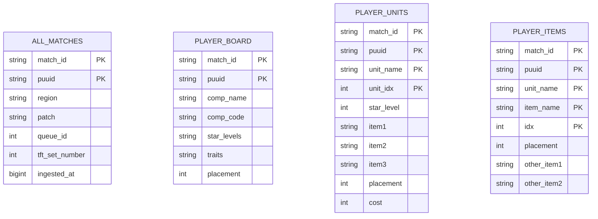
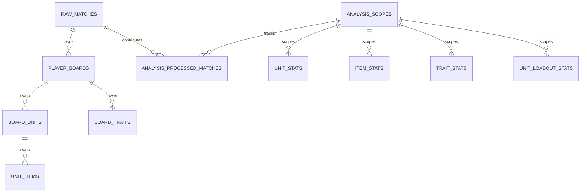
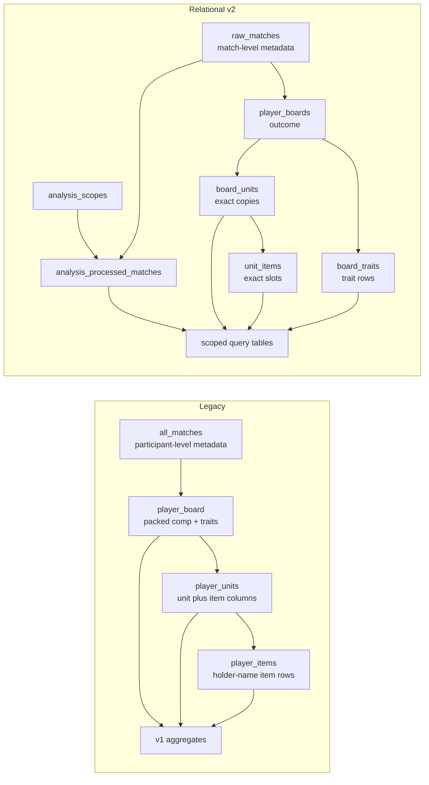

# Old versus new database models

This document contrasts the legacy flat model with the relational v2 model. The short version: v1 optimized for quick board-level inserts and simple aggregate rebuilds, while v2 optimizes correctness, exact relationships, idempotent scoped analytics, and lossless raw-match structure.

## Model inventory

| Area | Old model | New model | Main change |
| --- | --- | --- | --- |
| Match metadata | `all_matches` stored one row per participant/match pair | `raw_matches` stores one row per match | Match-level fields are no longer repeated for every participant. |
| Board summary | `player_board` stored packed strings like composition code, star levels, and traits | `player_boards` stores participant outcome and identity fields | Board identity is retained, while units and traits move to child tables. |
| Units | `player_units` stored one row per unit copy and included three item columns | `board_units` stores exact unit copies only | Items are separated so duplicate item instances and item slots are modeled directly. |
| Items | `player_items` stored item rows keyed by holder name and item index | `unit_items` stores item rows keyed by exact unit copy and slot | Items now reference `unit_idx`, avoiding ambiguity when duplicate copies of the same unit appear. |
| Traits | Packed `player_board.traits` string | `board_traits` child rows | Trait parsing is no longer required for normal queries, and inactive trait states can be preserved. |
| Analytics scope | Implicit current dataset and v1 query tables | `analysis_scopes` and `analysis_processed_matches` | Aggregates are explicitly tied to patch, queue, and set, with idempotent catch-up. |
| API compatibility | `matches`/legacy board-shaped tables | `matches` remains as compatibility projection | Compatibility survives, but canonical writes move to relational v2. |

## Structural comparison

### Legacy shape

The old tables shared common key columns, but the model did not express every relationship as a database-level foreign-key graph. Several relationships were implied by convention, packed strings, or duplicated fields.

### Relational v2 shape

The new model turns implied relationships into first-class keys. The raw graph is lossless enough for exact board reconstruction, and the query tables become scoped materializations rather than the primary representation of match data.

## Side-by-side data modeling differences

| Concern | Legacy behavior | Relational v2 behavior | Why it matters |
| --- | --- | --- | --- |
| Match metadata duplication | `all_matches` repeated match fields once per participant. | `raw_matches` stores match fields once. | Reduces storage duplication and avoids conflicts when repeated metadata disagrees. |
| Board composition | `comp_code`, `star_levels`, and `traits` packed multiple facts into strings. | Composition is reconstructed from `board_units`, and traits live in `board_traits`. | Queries can filter, join, and validate individual facts without parsing strings. |
| Duplicate units | `player_units` had `unit_idx`, but item rows keyed mainly by `unit_name`. | `unit_items` references `unit_idx` as part of its key. | Items on duplicate copies of the same champion remain attached to the correct copy. |
| Item slots | Unit rows had `item1`, `item2`, and `item3`; item rows also existed separately. | Each item has one row with `item_slot` constrained to 0-2. | The model has one canonical item-instance representation. |
| Trait state | Active trait tiers were packed into a delimited string. | Each trait state is a row with units, style, current tier, and total tier. | Inactive, bronze/silver/gold/prismatic, and exact tier details can be retained. |
| Cascading deletes | Relationships were mostly managed by code and naming conventions. | Composite foreign keys cascade from matches to boards to units/items/traits. | Cleanup and test isolation are safer and easier to reason about. |
| Scope identity | Aggregate tables effectively represented whichever dataset had been built. | Every aggregate row carries `scope_id`. | Multiple patch/queue/set universes can be built and validated explicitly. |
| Incremental refresh | Rebuild flows could recalculate aggregate tables but had weaker per-match idempotency. | `analysis_processed_matches` records each processed match per scope. | Catch-up can resume after failures without double-counting already processed matches. |
| Rollups | Rollups were encoded in aggregate conventions. | Sentinels are explicit: all star levels, all trait tiers, and item overall holder. | Tools can request rollups consistently while preserving detailed rows. |

## Query and analytics changes

In v1, analytics had to normalize packed strings and reconcile overlapping unit/item representations. In v2, analytics read a stable raw graph and write pre-aggregated rows inside a scope. This makes query tables faster for tools while keeping raw data detailed enough to rebuild them from scratch.

## Migration and compatibility notes

The legacy classes remain in the ORM for migration and one-release rollback. They include `AllMatch`, `LegacyPlayerBoard`, `LegacyPlayerUnit`, and `LegacyPlayerItem`. The `Match` class is a compatibility projection for current-scope board reads rather than the canonical write model.

Relational v2 also keeps some Python-level compatibility aliases and properties:

- `PlayerUnit` points at `BoardUnit`.
- `PlayerItem` points at `UnitItem`.
- `PlayerBoard.comp_code`, `PlayerBoard.star_levels`, and `PlayerBoard.traits` can reconstruct legacy-style strings from normalized child rows.
- `BoardUnit.item1`, `item2`, and `item3` can read normalized `UnitItem` rows by slot.

These compatibility paths help older tests and callers transition, but ingestion and durable storage should use normalized rows.

## Practical examples

### Reconstructing a board

| Step | Legacy | Relational v2 |
| --- | --- | --- |
| Find board | Read `player_board` by `match_id`, `puuid`. | Read `player_boards` by `match_id`, `puuid`. |
| Get units | Read `player_units` and sort by `unit_idx`. | Read `board_units` and sort by `unit_idx`. |
| Get items | Use `item1`/`item2`/`item3` columns or reconcile `player_items`. | Join `unit_items` on `match_id`, `puuid`, and `unit_idx`, then order by `item_slot`. |
| Get traits | Parse `traits` string segments. | Read `board_traits` rows directly. |

### Updating aggregate tables

| Step | Legacy | Relational v2 |
| --- | --- | --- |
| Pick dataset | Implied by available source rows and rebuild settings. | Resolve or create an `analysis_scopes` row for patch, queue, and set. |
| Prevent duplicate work | Mostly rebuild-oriented. | Check `analysis_processed_matches` for the match/scope pair. |
| Add outcomes | Derive from board/unit/item/trait rows. | Derive from normalized graph and update scoped aggregate rows. |
| Commit progress | Aggregate rows become the source of truth for that rebuild. | Aggregate rows and processed-match ledger commit together. |

## Tradeoffs

Relational v2 is more verbose: a single board creates more rows because units, item slots, and traits are separate entities. The tradeoff is intentional. The database now captures the domain relationships directly, avoids duplicated match metadata, makes exact item ownership unambiguous, and supports safe incremental analytics by scope.
